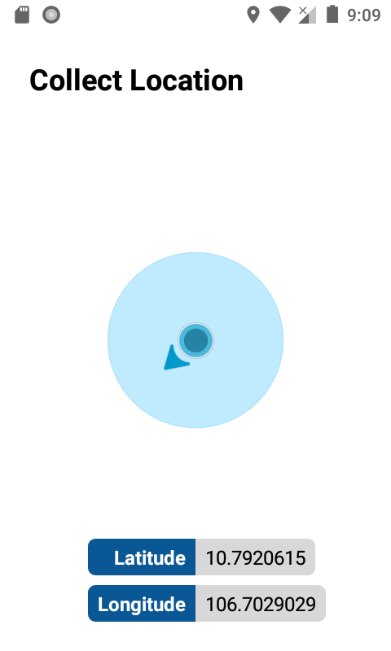

# Collect Location
Mobile tech test of Fossil

## Requires
- Current location must be updated every 5 seconds.
- Display latitude and longitude of current location.
- Draw a circle to display horizontal accuracy of current location.
- Draw a arrow to present horizontal direction of the location.

## Screenshot

